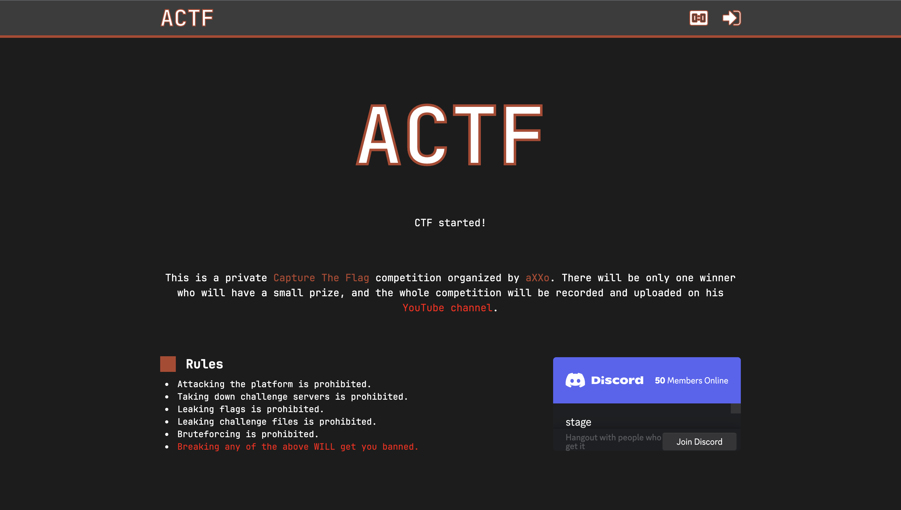

# CTF

<p align="center">
    
</p>

## What is this?

A CTF platform I designed specifically for videos. It is intended to be small and simple, and there are most likely much better alternatives out there. I do not recommend using it. Maybe some of you will find vulnerabilities in it lol. Be aware that it is still under development.

## Setup

### Host

Under `scripts/` you will find `start.sh`. On execution it runs the docker compose script and create the containers fro the Postgres DB, the API and the web aka next js app. The script does not automatically setup the tables of the database so you'll have to run the contents of the `init-db.sql` file yourself.

### Environment file

The `.env` file must be placed under `api/`, and is used with the docker compose script and the API. It must contain the following varriables:

- `DB_USER` -> The default user for the DB
- `DB_PASSWORD` -> UNUSED FOR NOW
- `DB_HOST` -> The IP of the DB (Should be localhost)
- `DB_NAME` -> The name of the default DB
- `TOKEN_KEY` -> The secret key for JWT token signature
- `SECRET_KEY` -> The secret key for specific API authentification (Like to signup users)

Example environment file:

```
DB_USER=YOUR_DB_USER
DB_PASSWORD=
DB_HOST=localhost
DB_NAME=ctf

TOKEN_KEY=MR4cBaCXYzSHAe1wHHiNqAGVMpcP9FnM
SECRET_KEY=super_secret_key
```

### Authentification

In order to create users, you will need to send a POST request to `/v1/auth/signup` of the API along with the `SECRET_KEY` which you set in the `.env` file of the API, the name of the user and its desired password.
